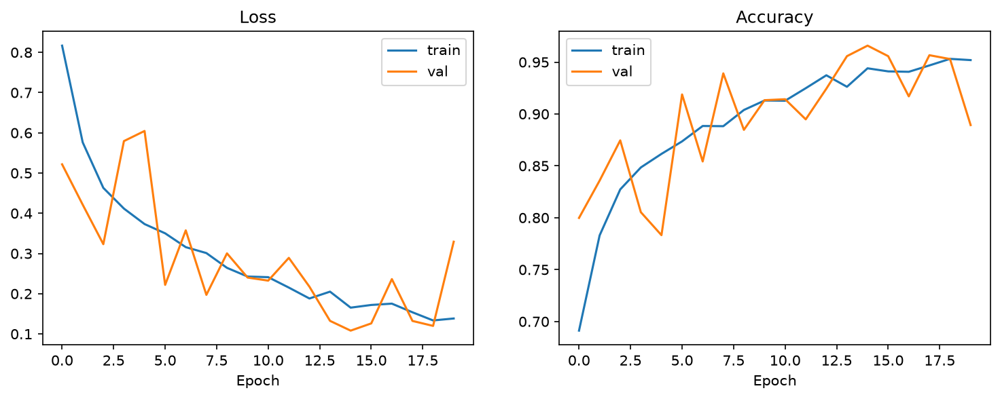

# FieldEye — Tomato Leaf Disease Diagnosis

A computer vision system that diagnoses tomato leaf disease from a single
photograph, built as a real, trained, evaluated deep learning pipeline —
not a wrapper around someone else's API.


## The Problem

Agricultural advisory services reach under 10% of smallholder farmers. By
the time crop disease is visible enough to act on, yield loss has often
already started, and there's rarely an accessible way to get a fast,
confident diagnosis in the field.

## What This Does

Point it at a tomato leaf photo, get back a disease diagnosis with a full
confidence breakdown across 5 classes — healthy, early blight, late blight,
leaf mold, and septoria leaf spot — in under a second, from a compact model
that trains and runs entirely on CPU.

## Results

| Metric | Score |
|---|---|
| Test Accuracy | **96.22%** |
| Test Macro F1 | **96.03%** |


Full breakdown, limitations, and failure-mode analysis in [MODEL_CARD.md](MODEL_CARD.md).

## Architecture

A compact custom CNN (4 conv blocks, ~590K parameters) — small by design, so
the entire pipeline trains in roughly 1-2 hours on CPU with no GPU required.


## Training Curves



Model selection used the checkpoint with the best **validation macro F1**
(epoch 15) rather than the final epoch, since validation performance was
noisy epoch-to-epoch — a real detail worth showing, not smoothing over.

## Project Structure

```
fieldeye-crop-diagnosis/
├── data/                  # raw images (gitignored) + processed split CSVs
├── notebooks/eda.py       # class distribution + sample grid
├── src/
│   ├── config.py          # single source of truth for all paths/hyperparameters
│   ├── data/               # loading, preprocessing, augmentation, DataLoaders
│   ├── models/model.py     # CropDiseaseCNN architecture
│   ├── train.py            # training loop, checkpointing, run logging
│   ├── evaluate.py         # held-out test evaluation, confusion matrix
│   ├── predict.py          # shared single-image inference logic
│   └── app/
│       ├── main.py         # FastAPI /predict endpoint
│       └── dashboard.py    # Streamlit demo UI
├── reports/                # all figures, metrics, run logs, best checkpoint
├── tests/test_pipeline.py
└── MODEL_CARD.md
```

## Setup

```powershell
git clone https://github.com/MuaazTasawar/fieldeye-crop-diagnosis.git
cd fieldeye-crop-diagnosis
python -m venv venv
.\venv\Scripts\Activate.ps1
pip install -r requirements.txt
```

Populate `data/raw/<class_name>/` with a tomato subset of the
[PlantVillage dataset](https://www.kaggle.com/datasets/emmarex/plantdisease)
— folder names must match the 5 classes in `src/config.py`.

## Usage

```powershell
# Explore the data
python notebooks\eda.py

# Train (add --quick for a fast smoke test first)
python src\train.py --quick
python src\train.py

# Evaluate on the held-out test set
python src\evaluate.py

# Run inference on a single image
python src\predict.py "path\to\leaf.jpg"

# Serve via API
uvicorn src.app.main:app --reload --port 8000
# -> visit http://127.0.0.1:8000/docs

# Interactive demo
streamlit run src\app\dashboard.py
```

## Testing

```powershell
pytest tests\ -v
```

## Limitations & Future Work

This is the core CV classifier — the ML foundation of a larger concept. Not
yet built, and documented as the deliberate next phase:

- **On-device deployment** (TFLite/ONNX quantization) for true offline field use
- **Satellite/weather data fusion** to forecast field-wide disease risk before symptoms appear elsewhere in a field
- **Real field-photo validation**, beyond PlantVillage's studio-style images

Full details in [MODEL_CARD.md](MODEL_CARD.md).

## Disclaimer

Portfolio/research project. Not validated for field or commercial
agricultural deployment.