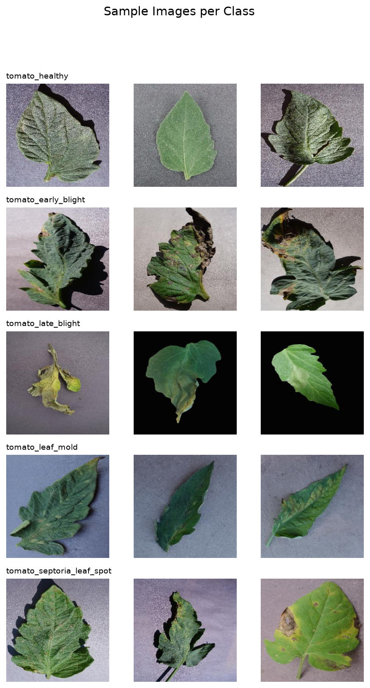
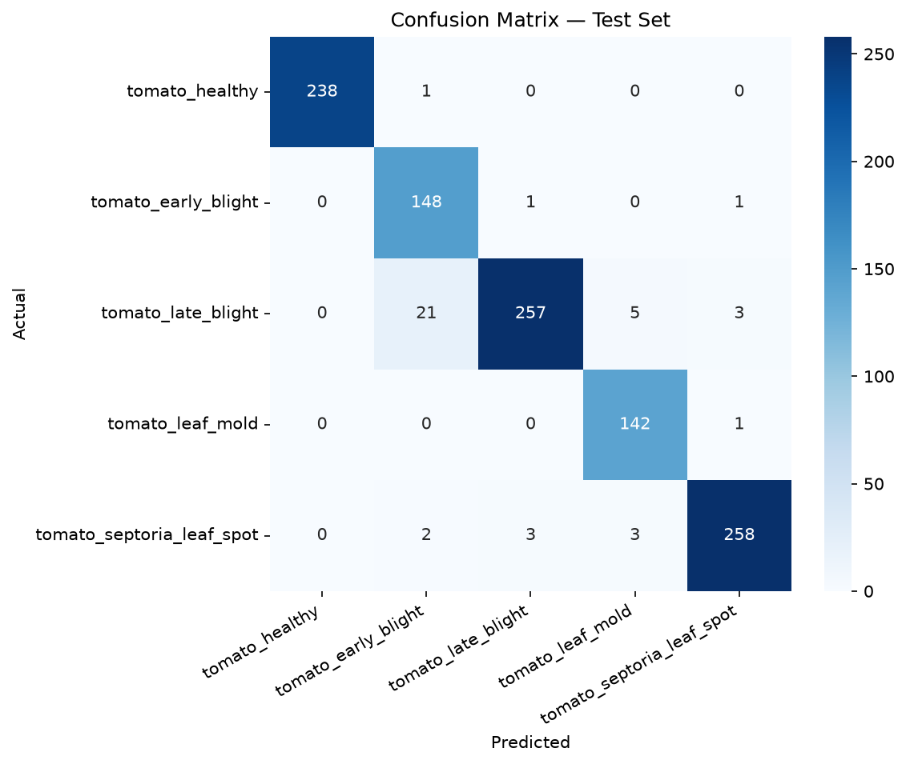
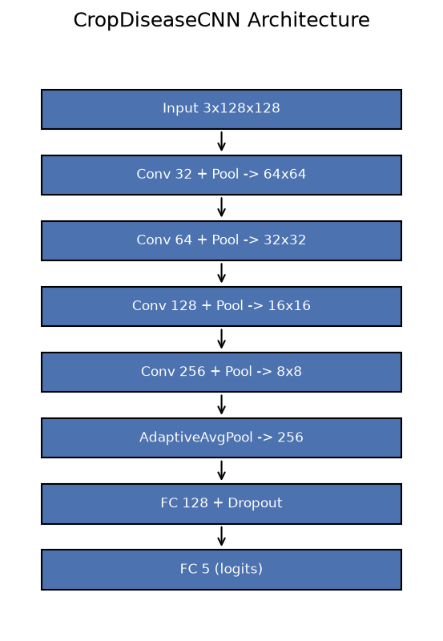

# FieldEye — Tomato Leaf Disease Diagnosis

A computer vision system that looks at a photo of a tomato leaf and tells you
which of 5 conditions it shows — healthy, or one of 4 diseases — with a
confidence score, in under a second. Built as a complete, real, evaluated
deep learning pipeline: real training, real held-out testing, real failure
analysis. Nothing here is a mockup.



> **New to machine learning terms?** Every technical term below (CNN, macro
> F1, stratified split, checkpoint, etc.) is explained in plain language the
> first time it appears, and again in the [Glossary](#glossary) at the
> bottom. You don't need an ML background to follow this document.

---

## Table of Contents

- [The Problem](#the-problem)
- [What This Does](#what-this-does)
- [Results — and What They Mean](#results--and-what-they-mean)
- [How It Works, Step by Step](#how-it-works-step-by-step)
- [The Model](#the-model)
- [The Dataset](#the-dataset)
- [Reading the Confusion Matrix](#reading-the-confusion-matrix)
- [Design Decisions (and Why)](#design-decisions-and-why)
- [Project Structure](#project-structure)
- [Setup](#setup)
- [Usage](#usage)
- [Testing](#testing)
- [Limitations & Future Work](#limitations--future-work)
- [FAQ](#faq)
- [Glossary](#glossary)
- [Disclaimer](#disclaimer)

---

## The Problem

Agricultural advisory services — the agronomists and extension officers who
help farmers identify crop problems — reach fewer than 10% of smallholder
farmers worldwide. By the time a farmer can visually confirm a disease has
taken hold, yield loss has often already begun, and there's rarely a fast,
free way to get a second opinion.

This project asks a narrow, testable version of a much bigger question:
**can a small, self-contained AI model, trained on public data, give a
useful first-pass diagnosis from nothing but a phone photo?**

## What This Does

You give it a photo of a tomato leaf. It gives you back:
1. **A diagnosis** — one of 5 classes: healthy, early blight, late blight,
   leaf mold, or septoria leaf spot.
2. **A confidence score** — how sure the model is (e.g. "99.97% confident").
3. **A full breakdown** — the probability it assigns to *every* class, not
   just the top guess, so you can see when it's genuinely uncertain versus
   when it's confidently wrong.

It runs in three ways, all built and working in this repo:
- **Command line** — point it at one image file, get a printed diagnosis.
- **API** (FastAPI) — send it an image over HTTP, get JSON back. This is the
  form a real app or website would talk to.
- **Interactive demo** (Streamlit) — a web page where you upload a photo and
  see the result visually, with a bar chart of confidence per class.

## Results — and What They Mean

| Metric | Score |
|---|---|
| Test Accuracy | **96.22%** |
| Test Macro F1 | **96.03%** |

**What is "test accuracy"?** Out of every 100 leaf photos the model had
never seen before (not used in training, not used to pick the best
checkpoint — completely held back), it correctly identified the disease in
about 96.

**Why report "macro F1" too, and what is it?** Accuracy alone can be
misleading when some classes have more examples than others (here, class
sizes range from 952 to 1,909 images — see [The Dataset](#the-dataset)). A
model could get a high accuracy score just by being great at the biggest
class and mediocre at the smallest one, and accuracy alone would hide that.
**F1 score** balances two things per class — precision (when it says
"diseased X," how often is it right?) and recall (of all the actual "X"
cases, how many did it catch?) — into one number. **Macro F1** averages that
F1 score *equally* across all 5 classes, regardless of how many images each
class had, so a weak class can't hide behind a strong one. Getting 96.03%
macro F1 means the model is genuinely solid across all 5 classes, not just
the popular ones.



Full per-class breakdown, exactly where the model gets confused and why, and
every known limitation: see [MODEL_CARD.md](MODEL_CARD.md).

## How It Works, Step by Step

This is the actual pipeline, in the order it runs, explained in plain terms:

1. **Data collection** — 7,223 labeled tomato leaf photos from the public
   [PlantVillage dataset](https://www.kaggle.com/datasets/emmarex/plantdisease),
   organized into 5 folders (one per class).
2. **Exploratory Data Analysis (EDA)** — before touching any modeling code,
   the data was inspected: how many images per class (checking for
   imbalance), and a visual sample grid to confirm the labels actually
   matched what the images showed. See `notebooks/eda.py` and
   `reports/figures/eda_class_distribution.png`.
3. **Preprocessing & splitting** — the 7,223 images were split into three
   non-overlapping groups: 70% for **training** (the model learns from
   these), 15% for **validation** (used *during* training to check progress
   and pick the best version — but never directly learned from), and 15%
   for **testing** (touched exactly once, at the very end, to report the
   final honest score). The split was **stratified**, meaning each of the
   three groups has the same proportion of each disease class as the full
   dataset — so, for example, the test set isn't accidentally missing one
   disease.
4. **Training** — the model looked at the training images repeatedly (20
   full passes, called **epochs**), adjusting its internal parameters each
   time to get better at predicting the correct label. After every epoch, it
   was checked against the validation set, and the version that scored best
   on validation (not necessarily the last one — see
   [Design Decisions](#design-decisions-and-why)) was saved.
5. **Evaluation** — the single best-saved version of the model was run
   *once* against the test set — images that had never influenced its
   training or checkpoint-selection in any way — to get the final, honest
   96.22% accuracy / 96.03% macro F1 numbers reported above.
6. **Serving** — the trained model was wrapped in an API (FastAPI) and a
   visual demo (Streamlit) so it can actually be used, not just benchmarked.

## The Model



The model is a **Convolutional Neural Network (CNN)** — a type of deep
learning model designed specifically for images. In plain terms: it looks at
small patches of the image first (edges, colors, textures), then combines
those into bigger patterns (leaf spots, discoloration shapes), then combines
*those* into a final decision about which disease is present. This is
similar to how a human expert might first notice a texture, then a spot
pattern, then conclude "that looks like blight."

Specifically, this model has:
- **4 convolutional blocks**, each shrinking the image while learning richer
  features (128×128 → 64×64 → 32×32 → 16×16 → 8×8 pixels).
- **~590,000 parameters** (the internal numbers the model adjusts during
  training) — this is a *small* model by deep learning standards (many
  modern models have hundreds of millions), chosen deliberately so the whole
  pipeline trains on an ordinary CPU in about an hour, with no expensive
  hardware required.
- A final classifier that turns the learned features into a probability for
  each of the 5 disease classes.

## The Dataset

- **Source:** [PlantVillage](https://www.kaggle.com/datasets/emmarex/plantdisease),
  a public dataset of leaf photos widely used in plant disease research.
- **Scope:** a 5-class tomato subset (this project didn't use the full
  38-class, multi-crop version — see [Future Work](#limitations--future-work)).
- **Class sizes:**

  | Class | Images |
  |---|---|
  | tomato_late_blight | 1,909 |
  | tomato_septoria_leaf_spot | 1,771 |
  | tomato_healthy | 1,591 |
  | tomato_early_blight | 1,000 |
  | tomato_leaf_mold | 952 |

  This is a **mild class imbalance** (the biggest class has about 2x the
  images of the smallest) — noticeable, but not severe enough to require
  special handling like oversampling. It's part of why macro F1, not just
  accuracy, was chosen as the headline metric.
- **Image style:** all photos are individual leaves against a plain,
  uniform background, taken in relatively controlled/studio-like
  conditions — not messy real-world field photos. This matters; see
  [Limitations](#limitations--future-work).

## Reading the Confusion Matrix


A **confusion matrix** is a grid that shows, for every combination of "what
the image actually was" (rows) and "what the model predicted" (columns), how
many test images fell into that box. The diagonal (top-left to
bottom-right) is where the model got it right; anywhere off the diagonal is
a mistake, and *where* those mistakes cluster is often more informative than
the overall accuracy number.

The clearest pattern here: **21 late blight images were misclassified as
early blight.** This isn't random noise — early and late blight are known in
plant pathology to look visually similar in their early stages, before
necrosis (tissue death) fully develops. In other words, the model's
confusion mirrors a real, documented diagnostic challenge — which is a more
convincing sign of a sound model than a spotless confusion matrix would be
(a model with *zero* mistakes on a nontrivial task is often a sign something
went wrong, like data leakage). See the actual misclassified images at
`reports/figures/misclassified_examples.png`.

## Design Decisions (and Why)

Every non-obvious choice in this project was made deliberately. Documenting
the *why*, not just the *what*, is the point of this section — it's the
difference between a project that happened to work and one where the
reasoning can be defended.

| Decision | Why |
|---|---|
| Small custom CNN instead of a pretrained backbone (e.g. ResNet18) | A pretrained backbone would likely reach comparable or higher accuracy with less data, but is much larger and slower to train on CPU. This project prioritized full CPU reproducibility — anyone can clone this and retrain it without a GPU. |
| Macro F1 as the primary metric, not just accuracy | With class sizes ranging from 952 to 1,909, accuracy alone could hide weak performance on the smaller classes. Macro F1 treats every class equally regardless of size. |
| Stratified train/val/test split | Ensures every split has a realistic, representative mix of all 5 classes — no split accidentally ends up missing or under-representing a disease. |
| Checkpointing the *best* validation-F1 epoch, not the *last* epoch | Validation performance fluctuated epoch to epoch (see `reports/figures/training_curves.png`) — epoch 20's own validation score (88.9% F1) was noticeably worse than epoch 15's (96.45%). Saving whichever epoch scored best avoids shipping a model that got worse right at the end. |
| Data augmentation (flip, rotation, color jitter) on training images only | Simulates the natural variation of real photos (different angles, lighting) so the model doesn't just memorize exact pixel patterns. Validation/test images are left un-augmented so the reported scores reflect real generalization, not artificially easier test conditions. |
| A held-out test set touched exactly once | Using the test set only for the single, final evaluation (never during training or model selection) is what makes the 96.22%/96.03% numbers an honest estimate of real-world performance, rather than a number the model was indirectly tuned toward. |

## Project Structure

```
fieldeye-crop-diagnosis/
├── data/
│   ├── raw/                  # original images, organized data/raw/<class_name>/*.jpg (gitignored — not in the repo, too large)
│   └── processed/            # train/val/test split, saved as CSVs of file paths (not copied images)
├── notebooks/
│   └── eda.py                 # exploratory data analysis: class counts, sample image grid
├── src/
│   ├── config.py               # every path, hyperparameter, and setting lives here — the single source of truth
│   ├── data/
│   │   ├── load_data.py         # scans data/raw/ and indexes every image + its label
│   │   └── preprocess.py        # builds the stratified split, defines image transforms/augmentation, creates PyTorch DataLoaders
│   ├── models/
│   │   └── model.py             # the CropDiseaseCNN architecture definition
│   ├── train.py                  # the training loop: trains, validates, checkpoints the best model, logs metrics
│   ├── evaluate.py               # runs the best checkpoint once on the held-out test set, produces the confusion matrix
│   ├── predict.py                # shared single-image inference logic, used by both the API and the demo
│   └── app/
│       ├── main.py                # FastAPI server exposing a /predict endpoint
│       └── dashboard.py           # Streamlit interactive demo
├── reports/
│   ├── figures/                    # every chart/diagram this pipeline produces (EDA, architecture, training curves, confusion matrix, misclassified examples)
│   ├── best_model.pt               # the saved weights of the best-performing model
│   ├── runs.csv                    # per-epoch training metrics log
│   └── metrics.json                # final test-set metrics, machine-readable
├── tests/
│   └── test_pipeline.py            # automated tests covering config, model shape, transforms, and (if present) real data/checkpoint
├── requirements.txt                 # exact Python packages needed
├── MODEL_CARD.md                    # detailed model documentation: data, metrics, limitations, ethics
└── README.md                        # this file
```

## Setup

```powershell
git clone https://github.com/MuaazTasawar/fieldeye-crop-diagnosis.git
cd fieldeye-crop-diagnosis
python -m venv venv
.\venv\Scripts\Activate.ps1
pip install -r requirements.txt
```

You'll also need the image data itself, since it's not stored in the repo
(too large for git). Download a tomato subset of the
[PlantVillage dataset](https://www.kaggle.com/datasets/emmarex/plantdisease)
and arrange it as `data/raw/<class_name>/*.jpg`, where the 5 folder names
exactly match the class names in `src/config.py`
(`tomato_healthy`, `tomato_early_blight`, `tomato_late_blight`,
`tomato_leaf_mold`, `tomato_septoria_leaf_spot`).

## Usage

```powershell
# 1) Explore the data — generates class distribution and sample-image figures
python notebooks\eda.py

# 2) Prepare the train/val/test split
python src\data\preprocess.py

# 3) Train the model
python src\train.py --quick     # fast smoke test (~1 min) — confirms everything runs before committing to a full run
python src\train.py             # full training run (~1-2 hours on CPU)

# 4) Evaluate on the held-out test set — produces the confusion matrix and final metrics
python src\evaluate.py

# 5) Run inference on any single image
python src\predict.py "path\to\leaf.jpg"

# 6) Serve as an API
uvicorn src.app.main:app --reload --port 8000
# then visit http://127.0.0.1:8000/docs to test the /predict endpoint interactively

# 7) Run the interactive demo
streamlit run src\app\dashboard.py
```

## Testing

```powershell
pytest tests\ -v
```

The test suite checks the parts of the pipeline that don't depend on having
the full dataset or a trained model downloaded (configuration correctness,
model output shape, image transform correctness), plus two additional tests
that automatically run only if real data or a real trained checkpoint are
present — so the suite passes cleanly both in a bare clone and in a fully
set-up local environment.

## Limitations & Future Work

This project is the ML core of a larger idea — a fully offline, field-usable
crop diagnosis tool. What's built here is real and complete on its own; what
follows is the honest list of what a "version 2" would add:

- **On-device deployment:** convert the model to TFLite or ONNX format with
  quantization (a technique that shrinks a model's size and speeds it up,
  with a small accuracy trade-off) so it can run directly on a phone with no
  internet connection — the actual "usable in the field" version.
- **Satellite + weather data fusion:** combine this single-photo classifier
  with regional satellite vegetation data (NDVI) and weather trends to
  forecast disease risk across an entire field, days before symptoms
  actually appear anywhere in it. This was scoped out of this project
  intentionally, as it's a separate systems-integration effort on top of
  this core classifier, not a natural extension of it.
- **Real field-photo validation:** this model was trained and tested only on
  PlantVillage's studio-style photos (plain background, single leaf,
  controlled lighting). Its accuracy on messy real-world phone photos —
  cluttered backgrounds, multiple leaves, harsh sunlight — is untested and
  likely lower.
- **Broader scope:** extending from this 5-class tomato subset to the full
  38-class, multi-crop PlantVillage dataset.
- **Pretrained backbone fine-tuning:** swapping the custom CNN for a
  fine-tuned ResNet18 or similar, likely trading CPU-only training for
  higher accuracy — a reasonable next step once GPU access is available.

Full technical detail on every limitation: [MODEL_CARD.md](MODEL_CARD.md).

## FAQ

**Q: Is this a real, working AI model, or a mockup/demo with fake results?**
A: Real. Every number in this README came from an actual training run and an
actual held-out test evaluation — you can reproduce it yourself by following
[Usage](#usage) above, and the raw run log is in `reports/runs.csv`.

**Q: Why only 5 disease classes, and only tomato?**
A: Scoped deliberately for a focused, fully-reproducible MVP that trains in
about an hour on ordinary hardware. See [Future Work](#limitations--future-work)
for the path to a broader scope.

**Q: Could this be used by an actual farmer today?**
A: Not as-is — it hasn't been tested on real field photos, only on curated
dataset images (see [Limitations](#limitations--future-work)). It's a
research/portfolio demonstration of the core technology, not a deployed
product.

**Q: What would make this more accurate?**
A: The single biggest lever would be a pretrained backbone (like ResNet18)
instead of the compact custom CNN — see the trade-off explained in
[Design Decisions](#design-decisions-and-why).

## Glossary

- **CNN (Convolutional Neural Network):** a deep learning model architecture
  built specifically for images, which learns visual patterns (edges,
  textures, shapes) in layers, from simple to complex.
- **Epoch:** one complete pass through the entire training dataset.
- **Checkpoint:** a saved snapshot of a model's learned parameters at a
  specific point in training, so it can be reloaded later without retraining.
- **Training / Validation / Test split:** three separate, non-overlapping
  groups of data. Training teaches the model; validation checks progress
  during training and helps pick the best version; test is used exactly
  once, at the end, for an honest final score.
- **Stratified split:** a way of splitting data that preserves the same
  class proportions in every split, so no split is accidentally skewed.
- **Accuracy:** the percentage of predictions that were correct.
- **Precision:** of everything the model *labeled* as class X, what
  percentage actually was X.
- **Recall:** of everything that *actually was* class X, what percentage
  the model correctly caught.
- **F1 score:** a single number combining precision and recall for one
  class.
- **Macro F1:** the F1 score averaged equally across all classes,
  regardless of how many examples each class has — prevents large classes
  from masking poor performance on small ones.
- **Confusion matrix:** a grid showing how many test examples of each true
  class were predicted as each possible class, making it easy to see which
  categories the model confuses with each other.
- **Data augmentation:** artificially varying training images (flipping,
  rotating, adjusting color) so the model learns to generalize rather than
  memorize exact images.
- **Quantization:** a technique that shrinks a trained model's size and
  speeds up its predictions, usually for deployment on phones or other
  low-power devices, at a small cost to accuracy.
- **Parameters:** the internal numeric values a model adjusts during
  training in order to learn; more parameters generally means a larger,
  more powerful, but slower and more resource-hungry model.

## Disclaimer

This is a portfolio and research project. It has not been validated for
field or commercial agricultural deployment, and should not be used as the
sole basis for real treatment decisions.